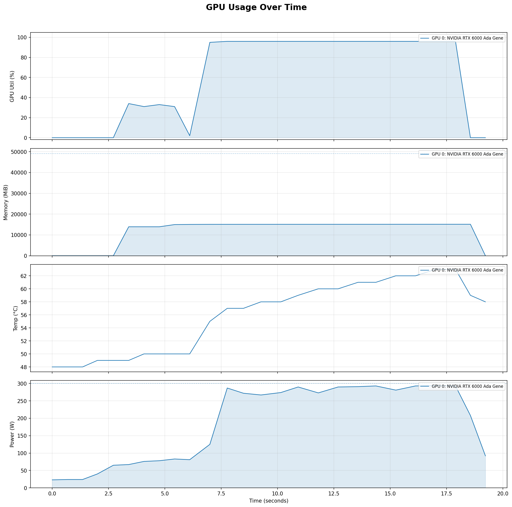
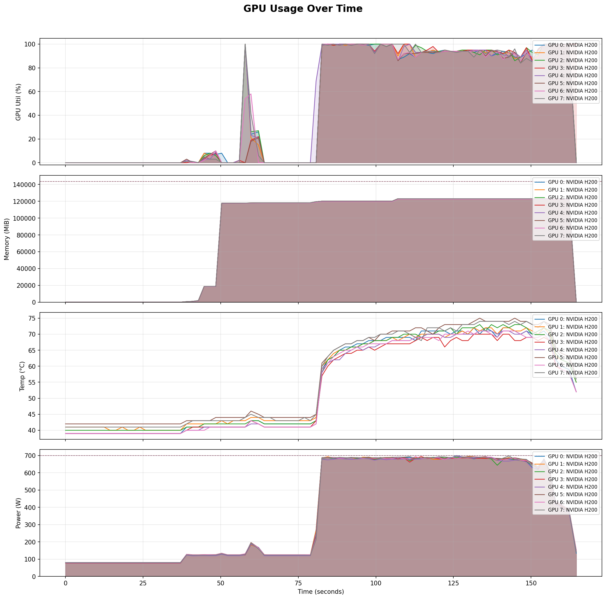

# GPU monitor

## Abstruct

Nvidia-smi based GPU usage visualizer.

```
$python3 main.py -h
usage: main.py [-h] {run,monitor,analyze} ...

GPU Usage Visualizer

positional arguments:
  {run,monitor,analyze}
    run                 Run a script while monitoring GPU
    monitor             Run nvidia-smi sampler only (background with &)
    analyze             Analyze and visualize a GPU log

options:
  -h, --help            show this help message and exit

Examples:
  main.py run train.sh
  main.py run train.sh -o my_log.txt -i 0.5
  main.py monitor -o gpu_log.txt &
  main.py analyze gpu_log.txt
  main.py analyze gpu_log.txt -o report.png
```

## Example

### Single GPU

- Model: DeepSeek R1 Distill Qwen 7B
- GPU: NVIDIA RTX 6000 Ada Generation



```
$ python3 gpu_monitor/main.py run run.sh -o log.txt -i 0.5
[gpu_monitor] Logging to : /home/oeda/kbb/log.txt
[gpu_monitor] Running    : /home/oeda/kbb/run.sh
[gpu_monitor] Interval   : 0.5s

Using GPU: NVIDIA RTX 6000 Ada Generation

```

### Multi GPUs

- Model: DeepSeek R1 Distill Llama 70B
- GPU: H200*8



```
#!/bin/bash
#SBATCH --time=00:20:00
#SBATCH --nodes=1
#SBATCH --ntasks-per-node=1
#SBATCH --cpus-per-task=56
#SBATCH --gres=gpu:8
#SBATCH --mem=1880G
#SBATCH --mail-user=j22424@inc.kisarazu.ac.jp
#SBATCH --mail-type=BEGIN,END,FAIL
#SBATCH --job-name="h200"
##SBATCH --hint=multithread

# Set CUDA environment variables
export CUDA_HOME=/scratch/public/nvidia/cuda/cuda-13.0
export CUDA_PATH=/scratch/public/nvidia/cuda/cuda-13.0
export PATH=${CUDA_HOME}/bin:$PATH
export LD_LIBRARY_PATH=${CUDA_HOME}/lib64:$LD_LIBRARY_PATH

# Choose ONLY IB HCAs (adjust names to your node: mlx5_0..mlx5_11 are shown)
export NCCL_IB_HCA="mlx5_0,mlx5_1,mlx5_3,mlx5_4,mlx5_5,mlx5_6,mlx5_7,mlx5_9,mlx5_10,mlx5_11"
# Make NCCL stop trying to "fuse" different NIC types
export NCCL_NET_MERGE_LEVEL=LOC
# Prefer IB GID index 0 for IB (if your site uses a different index for RoCE/IB, set accordingly)
export NCCL_IB_GID_INDEX=0

cd ${HOME}/tsune

DIST_INIT_ADDR=$(scontrol show hostnames $SLURM_JOB_NODELIST | head -n 1)

srun --ntasks=1 --ntasks-per-node=1 --cpus-per-task=56 \
--cpu-bind=none --output=${HOME}/run/sglang.${SLURM_JOB_ID}.%t \
bash -c "export NCCL_DEBUG=INFO; \
export DIST_INIT_ADDR=${DIST_INIT_ADDR}; \
export CUDA_HOME=/scratch/public/nvidia/cuda/cuda-13.0; \
export CUDA_PATH=/scratch/public/nvidia/cuda/cuda-13.0; \
export SGLANG_DISABLE_CUSTOM_KERNELS=1; \
export SGLANG_DISABLE_CUDA_GRAPH=1; \
export PATH=${CUDA_HOME}/bin:\$PATH; \
export LD_LIBRARY_PATH=${CUDA_HOME}/lib64:\$LD_LIBRARY_PATH; \
export TORCH_CUDA_ARCH_LIST=\"9.0\"; \
export SGLANG_DISABLE_CUDNN_CHECK=1; \
export SGLANG_USE_UVLOOP=0; \
export TRITON_CACHE_DIR=/tmp/triton_cache_\${SLURM_PROCID}_\$\$; \
source /scratch/home/apacsc11/.venv/bin/activate; \
python ${HOME}/tsune/gpu_monitor/main.py monitor -o ${HOME}/tsune/gpu_log.${SLURM_JOB_ID}.txt -i 1 & \
GPU_MON_PID=\$!; \
python \
-m sglang.bench_offline_throughput \
--model-path ${HOME}/models/deepseek-distill-70b \
--dataset-path ${HOME}/models/sharegpt/ShareGPT_V3_unfiltered_cleaned_split.json \
--num-prompts 2000 --seed 2025 --dtype bfloat16 --tp 8 --attention-backend flashinfer --mem-fraction-static 0.8 --cuda-graph-max-bs 128 \
--nnodes 1 --trust-remote-code \
--dist-init-addr \${DIST_INIT_ADDR}:5000 --node-rank \${SLURM_PROCID} \
--dist-timeout 3600 \
2>&1 | tee ${HOME}/livelog/stdout.${SLURM_JOB_ID}"

```
